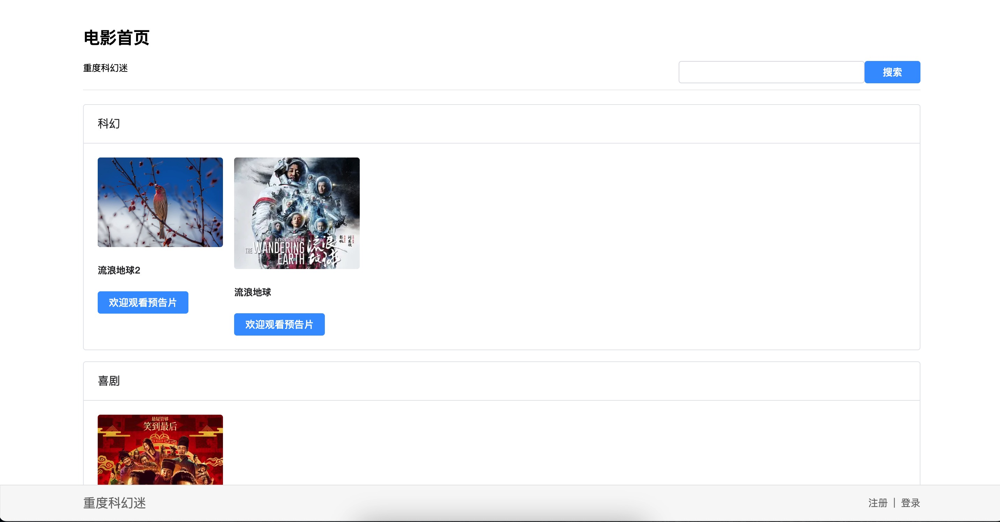

基于 Midwayjs 一体化的电影网站 - 全栈项目

## 关于

基于 Midwayjs [一体化](https://midwayjs.org/docs/hooks/intro)方案实现 [koajs-movie](https://github.com/savoygu/koajs-movie) 电影网站，该方案是以 Midway Hooks 为主函数式全栈框架，值得一提的是该项目中使用其组件 `@midwayjs/koa` 以 Koa 作为上层框架作为 Http 服务。相较于 [koajs-movie](https://github.com/savoygu/koajs-movie) 的实现该方案极大简化了接口开发，利用函数式替代了 MVC 开发模式，且在这样的前后端一体化应用中，接口调用也及其简单，只需要导入函数 API 直接调用即可。

相较于 [koajs-movie](https://github.com/savoygu/koajs-movie) 的方案

- 使用 Midwayjs hooks 替代 Koa
- 使用 Prisma 替代 mongoose
- 使用 Vue 替代模板引擎 Pug
- 使用 Element Plus 替代 Bootstrap

## 技术栈

- [Midwayjs Hooks](https://github.com/midwayjs/midway)
- [Vue](https://github.com/vuejs/core)
- [Prisma](https://github.com/prisma/prisma)
- [Pinia](https://github.com/vuejs/pinia)
- [Zod](https://github.com/colinhacks/zod)
- [Element Plus](https://github.com/element-plus/element-plus)

## 项目构建

- `npm run dev`: 启动开发服务器
- `npm run build`: 构建用于生产的应用
- `npm run start`: 生产模式下运行项目

## 目录结构

- `src`: 源代码：包括后端和前端
  - `api`: 后端代码
  - `components`: 前端代码 - 组件
  - `layout`: 前端代码 - 布局
  - `router`: 前端代码 - 路由
  - `store`: 前端代码 - 状态
  - `utils`: 前端代码 - 工具
  - `views`: 前端代码 - 视图
- `public`: 静态文件
- `midway.config.ts`: Midwayjs 配置
- `tailwind.config.js`: Tailwind 配置
- `index.html`: 入口文件

## 贡献者

<!-- ALL-CONTRIBUTORS-LIST:START - Do not remove or modify this section -->
<!-- prettier-ignore-start -->
<!-- markdownlint-disable -->
<table>
  <tbody>
    <tr>
      <td align="center" valign="top" width="14.28%"><a href="https://github.com/savoygu"> <b>huel129</b></a> <a href="#design-savoygu" title="Design">🎨</a> <a href="#ideas-savoygu" title="Ideas, Planning, & Feedback">🤔</a> <a href="https://github.com/savoygu/midwayjs-hooks-movie/commits?author=savoygu" title="Documentation">📖</a> <a href="https://github.com/savoygu/midwayjs-hooks-movie/commits?author=savoygu" title="Code">💻</a> <a href="https://github.com/savoygu/midwayjs-hooks-movie/issues?q=author%3Asavoygu" title="Bug reports">🐛</a></td>
    </tr>
  </tbody>
</table>

<!-- markdownlint-restore -->
<!-- prettier-ignore-end -->

<!-- ALL-CONTRIBUTORS-LIST:END -->
